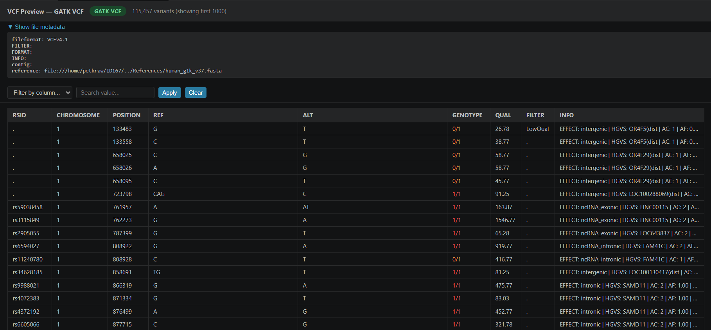
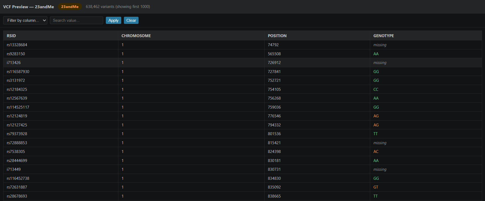
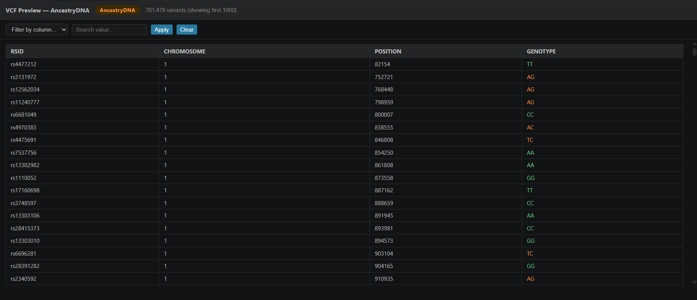
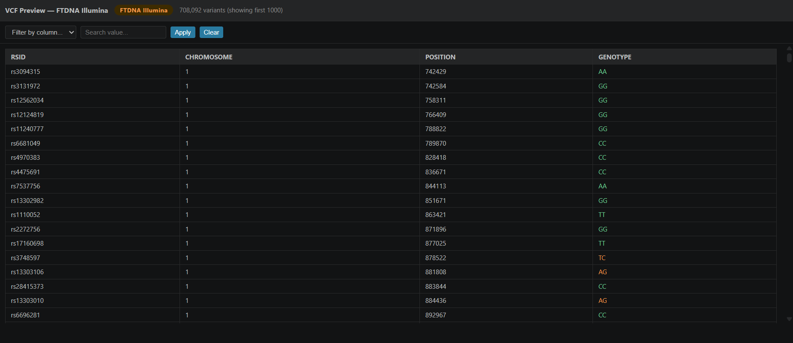
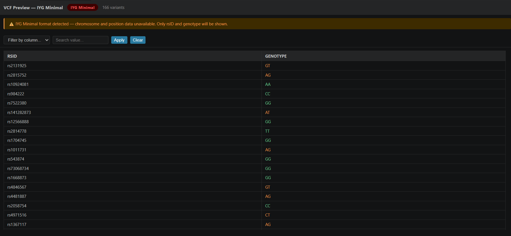

# VCF & Genotype File Parser- User Guide

BioDataHub supports parsing and previewing multiple genomic file formats
directly inside VS Code. This guide explains how to use the parser and
what formats are supported.

---

## How to Use

1. Open the Command Palette with `Ctrl+Shift+P`
2. Type `Open VCF` and select **BioDataHub: Open VCF / Genotype File**
3. Navigate to your file and click Open
4. The parser will auto-detect the format and display your data

Supported file extensions: `.vcf`, `.txt`, `.csv`

---

## Supported Formats

### 1. Standard GATK VCF (Tier 1- Full Support)

The gold standard VCF format produced by tools like GATK HaplotypeCaller.
Supports full metadata viewing, REF/ALT columns, QUAL, FILTER, and
parsed INFO fields.

### 2. 23andMe Raw Data

Tab-separated personal genomics file from 23andMe. Displays rsID,
chromosome, position and genotype. Missing genotypes (`--`) are
clearly flagged.

### 3. AncestryDNA Raw Data

Tab-separated file with separate allele1 and allele2 columns.
Alleles are combined into a single genotype for display.

### 4. FTDNA Illumina (CSV)

Comma-separated file from Family Tree DNA Illumina with quoted fields.
Displays RSID, chromosome, position and result.

### 5. IYG Minimal Format

Minimal format with only rsID and genotype. No position or
chromosome data available in this format.

---

## Format Detection

The parser automatically detects which format your file is using.
Each format is assigned a confidence tier shown as a coloured badge:

| Badge | Tier | Meaning |
|-------|------|---------|
| 🟢 Green | Tier 1 | Full VCF spec- all fields available |
| 🟠 Orange | Tier 2 | Consumer genomics- core fields available |
| 🔴 Red | Tier 3 | Minimal format- limited fields |

---

## Genotype Colouring

Genotypes are colour coded for quick visual scanning:

| Colour | Meaning | Example |
|--------|---------|---------|
| Green | Homozygous reference | AA, GG, TT, 0/0 |
| Orange | Heterozygous | AG, CT, 0/1 |
| Red | Homozygous alternate | 1/1 |
| Grey italic | Missing data | --, . |

---

## Known Limitations

- Display is capped at 1000 rows for performance
- Compressed `.vcf.gz` files are not yet supported
- INFO column text may be truncated for long values
- IYG minimal format has no position or chromosome data

---

## Coming in Future Updates

- Real-time filtering as you type
- Download filtered variants as CSV
- Support for compressed `.vcf.gz` files
- Pagination for large files